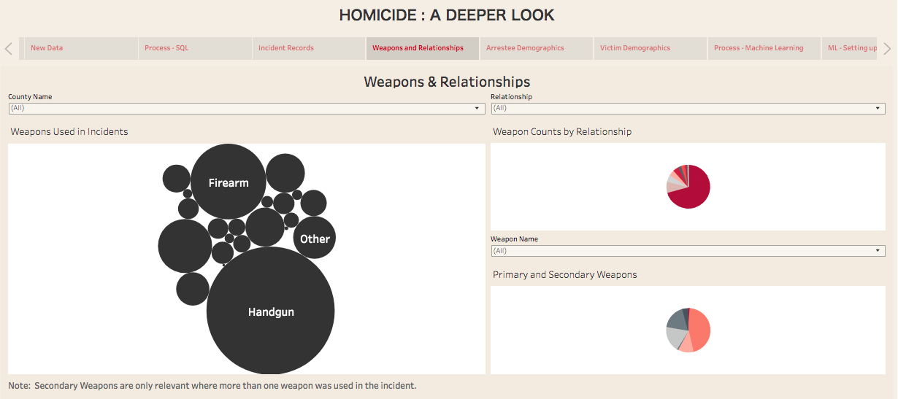

# Homicide Machine Learning

View full Tableau presentation [here](https://public.tableau.com/profile/andrea.morgan7582#!/vizhome/ML_Homicide/HomicidePredictingCrimeTrends).

## Background

Since the early 1900s, law enforcement agencies have voluntarily provided crime statistics through the Uniform Crime Reporting (UCR) Program. As technology has progressed, the FBI now provides that data to the public through its [Crime Data Explorer](https://crime-data-explorer.fr.cloud.gov/downloads-and-docs). They offer an API as well as bulk downloads of their datasets.

In mid-2019, the FBI released its expanded homicide data. While broad demographic and incident data was offered prior to this expansion, the  data now includes detailed breakdowns of each incident including the specific type of homicide, weapons used, and a breakdown of all the victims, offenders, and arrestees involved.

Since Tennessee is our home state and 100% of its agencies voluntarily report their statistics to the FBI, our group of three data analysts chose to explore homicide data from 2007 to 2018 and create a machine learning model that uses demographic data of the victim or arestee to predict the specific type of homicide and weapon used in the crime.

## Analysis

* Total number of incidents as well as the victims/arrestees involved, broken down by county

* The relationship between the type of relationship between the victim and arrestee and the weapon(s) used

* Arrestee and victim demographic data

## Machine Learning

* Two models: arrestee predictions and victim predictions

* Data: for testing/training, we used data from 2007-2017; for predicting, we used 2018 demographic data and compared the prediction to the actual statistics from 2018.

* For each model, we compiled demographic data for that respective population (age, gender, and race)

* Using scikit-learn, we created a pipeline and used logistic regression to create models that would predict the type of homicide and weapon used

## Machine Learning Results

While the machine learning models were effective at predicting the type of homicide and weapon used for each population, a much larger dataset would help train the models with even better accuracy. 
* Both models predicted that the same type of homicide would occur nearly 100% of the time (Murder and Non-Negligent Homicide). While this is not surprising given the overwhelming number of occurrences of that type in the given incidents, it would be interesting to discover what demographics might lead to one of the other types of homicide.
* When it came to predicting what type of weapon would be used, the models had a more difficult time predicting with any variety. Since there are so many types of weapons involved in the agencies' statistics, it's difficult for a model to train well on this dataset size.

In comparing the predicted 2018 homicide type and weapon to the actual 2018 data, it appears that the models made decent predictions given this dataset.

#### Actual 2018 Data Versus Predicted 2018 Data

 
